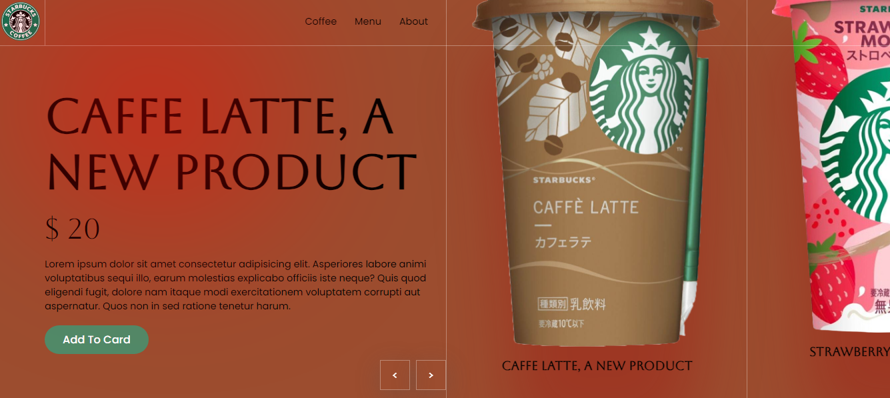

# Any website nowadays almost needs a slider at the top of the page to make the website stand out, especially commercial business websites. Slider will help them show off many of their products in the same frame and take up the least amount of space, thereby creating much more sympathy for users.

## There are many ways to create a slider, the most popular in web programming is using HTML CSS and Javascript.

# Любой веб-сайт в наши дни нуждается в слайдере в верхней части страницы, чтобы выделиться, особенно коммерческие веб-сайты. Слайдер поможет им продемонстрировать многие из своих продуктов в одном кадре и займет минимум места, тем самым вызывая гораздо больше симпатии у пользователей.
## Существует множество способов создания слайдера, наиболее популярным в веб-программировании является использование HTML, CSS и Javascript.

 HTML, CSS, JavaScript 

 